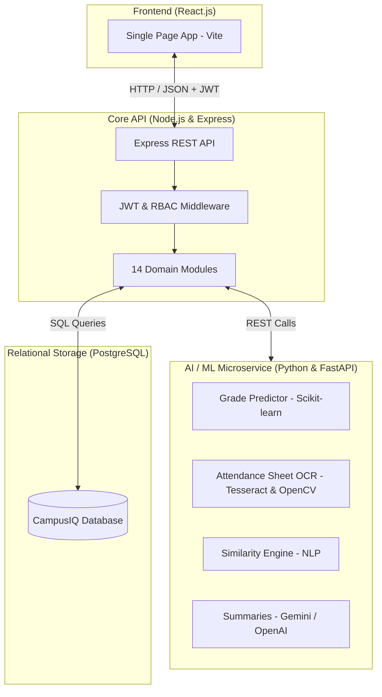

# Architectural Diagrams

```mermaid
flowchart TD
    subgraph Client ["Frontend (React.js)"]
        UI[Single Page App - Vite]
    end

    subgraph Backend ["Core API (Node.js & Express)"]
        Gateway[Express REST API]
        Auth[JWT & RBAC Middleware]
        Modules[14 Domain Modules]
    end

    subgraph AI ["AI / ML Microservice (Python & FastAPI)"]
        Predictor[Grade Predictor - Scikit-learn]
        OCR[Attendance Sheet OCR - Tesseract & OpenCV]
        Plagiarism[Similarity Engine - NLP]
        GenAI[Summaries - Gemini / OpenAI]
    end

    subgraph Storage ["Relational Storage (PostgreSQL)"]
        DB[(CampusIQ Database)]
    end

    UI <-->|HTTP / JSON + JWT| Gateway
    Gateway --> Auth
    Auth --> Modules
    Modules <-->|SQL Queries| DB
    Modules <-->|REST Calls| AI
```
